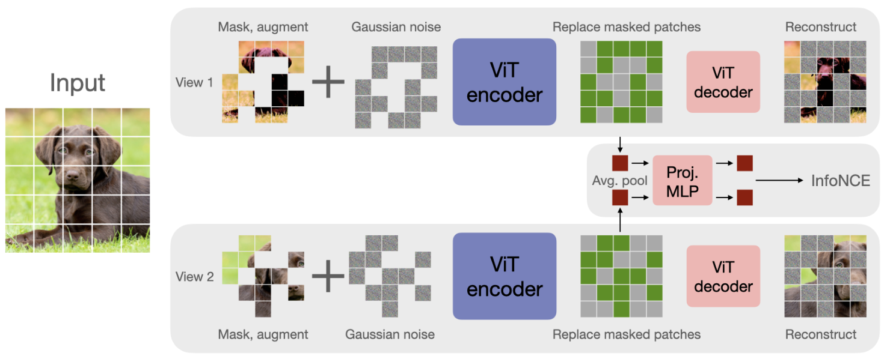

# CAN: Contrastive Masked Autoencoders and Noise Prediction Pretraining

PyTorch reimplementation of ["A simple, efficient and scalable contrastive masked autoencoder for learning visual representations"](https://arxiv.org/abs/2210.16870).


<p align="center">

</p>

### Requirements
- Python 3.8+
- `pip install -r requirements`

### Usage
To pretrain a ViT-b/16 network run:
```
python train.py --accelerator gpu --devices 1 --precision 16  --data.root path/to/data/
--max_epochs 1000 --data.batch_size 256 --model.encoder_name vit_base_patch16
--model.mask_ratio 0.5 --model.weight_contrast 0.03 --model.weight_recon 0.67 
--model.weight_denoise 0.3
```
- Run `python train.py --help` for descriptions of all options.
- `--model.encoder_name` can be one of `vit_tiny_patch16, vit_small_patch16, vit_base_patch16, vit_large_patch16, vit_huge_patch14`.

#### Using a Pretrained Model
Encoder weights can be extracted from a pretraining checkpoint file by running:
```
python scripts/extract_encoder_weights.py -c path/to/checkpoint/file
```
You can then initialize a ViT model with these weights with the following:
```python
import torch
from timm.models.vision_transformer import VisionTransformer

weights = torch.load("path/to/weights/file")

# Assuming weights are for a ViT-b/16 model
model = VisionTransformer(
    patch_size=16,
    embed_dim=768,
    depth=12,
    num_heads=12,
)
model.load_state_dict(weights)
```
- __Note__: `VisionTransformer` arguments should match the those used during pretraining (e.g. ViT-b/16, ViT-l/16, etc.).

